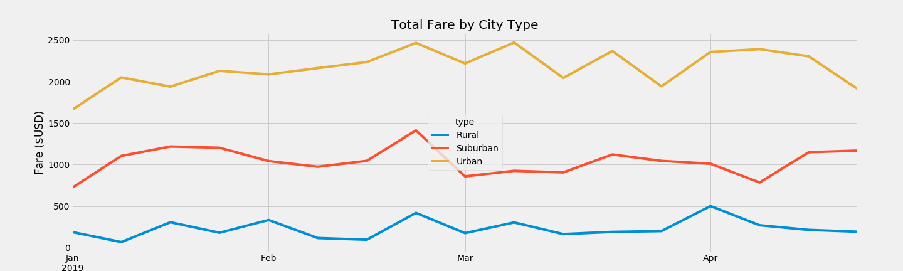

# PyBer_Analysis
## Overview of the analysis:

# The purpose:  Create the charts to show the relationship between the type of cities, drivers and riders. This analysis will help Pyber company to  imporve acces and determine affordability for underserved neighborhoods.

# Results:

There is a description of the differences in ride-sharing data among the different city types. Ride-sharing data include the total rides, total drivers, total fares, average fare per ride and driver, and total fare by city type. 

Based on the graph "Total Fare by City Type", we can see that Urabn city has the highest number of fares but it decreasing. The suburban is the potential city, which has the number of fares is increasing. With the rural cities, number of fare is not changing a lot and they might be decreasing.

# Summary:

##There is a statement summarizing three business recommendations to the CEO for addressing any disparities among the city types. 
Based on the data type, we can have a short conclusion for the CEO that the demand of using ride-sharing app in Urban cities is higher than Rural and Suburban citites. That is why Urban cities have more driver and the average fare per ride as well as per drivers are cheaper than the 2 others cities. The PyBer company should focus more on Suburban city especially Rural cities to bring more chance to these 2 cities to have cheaper price on fares. 

